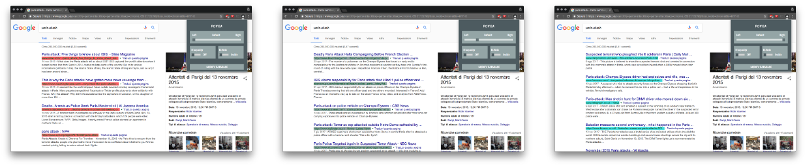

# FOVEA

Fovea is a Chrome Extension created to help the user break out the filter bubble. It allows to prioritize left or right-wing news websites by changing the order of the Google-search results.

## Slider
The slider allows to reorder the Google search results accordingly to a database of names that can be edited.
Hardcoded in the plugin there is a default database that will be used in case the custom one is left blank.

## UI Equality
This switch transforms the UI of every website in a version as much neutral as possible. It creates an iframe where only plain text is displayed. 
This feature was implemented modifying the source code of [Just Read](https://github.com/ZachSaucier/Just-Read) by [Zach Saucier](https://github.com/ZachSaucier).

## Bubble
This switch blocks every website that has been already visited, by comparing the user's browser history with the current webpage.

#### Exhibition version
The exhibition version includes a physical interface made with an Arduino MKR1000. The communication between the Arduino and the Extension happens via the MQTT protocol.

#### Credits
Fovea was developed as a university project at Malmo University in January 2018. The team included also Ivan Davoud, Lenard George Swamy and Marilin Lougas
